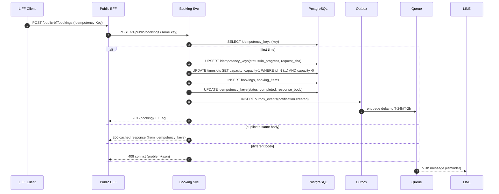

承知しました。いただいた**デフォルト決定(#1〜#10)**を一次情報として採用し、**② 改善案フルセット**を提示します。
（※各所に**根拠**を明記。推定は **\[仮説]** で注記）

---

## 1) プロジェクト理解（As-Is要約）

* **1行要約**：LINE LIFF を入口とする**小規模予約SaaS**。現状は **Fastify+Drizzle+PostgreSQL の単一API**、**Vite/React の LIFF デモ & 管理画面**、通知は node-cron の簡易送信で運用。将来仕様（API v1/ETag/Idempotency/在庫スロット/Outbox）は docs に定義済。
  （根拠：\[source: README.md#194–200], \[source: apps/api/src/server.ts#L17-L21], \[source: docs/api/api\_spec.md#1–13]）

* **ドメイン境界（C4: Context）**

  * アクター：来店客（LINE/LIFF）, 店舗スタッフ&管理者（管理画面）, 運用者
  * システム：**LIFFフロント**→LINE IDトークン→**/auth/line** で検証→JWT発行→**/reservations など**
    （根拠：\[source: apps/liff-demo/src/hooks/useLiff.ts#L11-L21], \[source: apps/api/src/server.ts#L23-L31]）

* **主要ユースケース TOP5**

  1. LIFFでメニュー選択→時間→確認→予約完了（4ステップ）
     （根拠：\[source: apps/liff-demo/src/pages/Reserve.tsx#L9-L16, L66-L77, L120-L136]）
  2. 管理画面で当日予約の一覧・ステータス更新
     （根拠：\[source: apps/admin-web/src/pages/TodayReservations.tsx#L6-L15, L152-L160]）
  3. 期間指定の予約一覧・ページング
     （根拠：\[source: apps/admin-web/src/pages/Reservations.tsx#L1-L8, L130-L140]）
  4. メニューCRUD（一覧/作成/更新/削除）
     （根拠：\[source: apps/api/src/server.ts#L191-L203, L225-L283]）
  5. 予約リマインドの定期送信（cron）
     （根拠：\[source: apps/api/src/worker.ts#L5-L18]）

* **主要KPI（docsの事業KPI）**：ノーショー率↓/再来率↑/導入速度/稼働率 等（**0→1 ロードマップ**）
  （根拠：\[source: docs/ROADMAP.md#L8-L16, L169-L182]）

* **非目標（未実装）**：**ETag/If-None-Match/If-Match**, **Idempotency 強制**, **timeslots 在庫**, **Outbox/Webhook**, **ヘッダページング** 等は**仕様にあるが未実装**
  （根拠：\[source: docs/api/api\_spec.md#80–140, #440–456], \[source: docs/api/tables\_spec.md#L213-L224, L385-L396], \[source: apps/api/src/server.ts#全体（該当未実装）]）

* **既存アーキ（クライアント/BFF/サービス/データ/イベント/インフラ）**

  * クライアント：Vite/React（LIFF/管理）。**API直叩き & ky**、camel/snake マッパあり
    （根拠：\[source: apps/admin-web/src/lib/api/unifiedClient.ts#L1-L9, L186-L200]）
  * BFF：**なし**（クライアント→API直）
  * サービス：Fastify モノリス（/auth/line, /reservations, /menus, **簡易レート制限**）
    （根拠：\[source: apps/api/src/server.ts#L23-L31, L84-L90, L191-L203], \[source: apps/api/src/lib/rate-limit.ts#L1-L16, L109-L113]）
  * データ：最小スキーマ（stores/members/reservations/notification\_jobs/menus）
    （根拠：\[source: apps/api/src/db/schema.ts#L3-L14, L33-L53]）
  * イベント/非同期：cronのみ。**OutboxテーブルはDDLに定義**
    （根拠：\[source: apps/api/src/worker.ts#L5-L18], \[source: docs/api/tables\_spec.md#L337-L370]）
  * インフラ：Docker Compose（本番は Cloud Run + CF Pages 想定）
    （根拠：\[source: docker-compose.yaml#L2-L16, L94-L101], \[source: README.md#194–200]）

* **現行UIのIA/主要フロー/ペイン**

  * 管理 IA：ダッシュボード/当日/予約一覧/顧客/メニュー/設定
    （根拠：\[source: apps/admin-web/src/layouts/AdminLayout.tsx#L11-L16]）
  * LIFF IA：Home→Reserve（menu→time→confirm→done）/Membership
    （根拠：\[source: apps/liff-demo/src/pages/Home.tsx#L15-L20, L90-L96], \[source: apps/liff-demo/src/pages/Reserve.tsx#L10-L16, L66-L77, L168-L176]）
  * ペイン：**二重投稿の整合性不安（Idempotency簡略）**、**在庫表示/確保なし**、**ETag/短TTLなし**
    （根拠：\[source: docs/api/api\_spec.md#L126-L136, L118-L123], \[source: apps/api/src/server.ts#全体]）

---

## 2) 現状監査（Architecture × UX 横断）

* **アーキ 12観点（0–4）**
  境界2 / API2 / データ整合2 / パフォ2 / キャッシュ1 / 障害分離1 / 冪等1 / 可観測2 / セキュリティ2 / デプロイ2 / コスト2\[仮説] / 運用性2

  * **根拠**：REST/フラット/ヘッダページングの**v1仕様は明記**（未実装多）\[source: docs/api/api\_spec.md#L6-L17]、在庫/Outbox/監査のDDL有 \[source: docs/api/tables\_spec.md#L213-L224, L337-L380]、現APIは最小CRUDとcronのみ \[source: apps/api/src/server.ts#L191-L203, L205-L283; apps/api/src/worker.ts#L5-L18]。

* **UX 12観点（0–4）**
  IA3 / ナビ3 / 一貫性3 / 学習3 / 入力摩擦2 / 状態管理2 / フィードバック2 / エラー&空2 / レスポンシブ3 / アクセシビリティ2 / 国際化1 / ブランド2

  * **根拠**：LIFF 4ステップ、管理はshadcn系UIで整然 \[source: apps/liff-demo/src/pages/Reserve.tsx#L10-L16, L66-L77], \[source: apps/admin-web/src/components/ui/\*]。空状態/エラーが**統一未**、i18n未導入 \[source: apps/admin-web/src/pages/TodayReservations.tsx#L6-L15, L146-L154], \[source: docs/LP.md#L1-L8（LP構成）]。

* **主要ボトルネック**

  1. **Idempotency未強制**による二重投稿整合性 \[source: docs/api/api\_spec.md#L129-L136]
  2. **timeslots未導入**によるダブルブッキング・空き不整合 \[source: docs/api/tables\_spec.md#L213-L224], \[source: docs/追加要件.md#L7-L14]
  3. **ETag/短TTL未対応**で一覧/空き照会の負荷 \[source: docs/api/api\_spec.md#L86-L90, L121-L123]
  4. **Outbox未運用**で再送・重複ガードが弱い \[source: docs/api/tables\_spec.md#L337-L370]

* **Quick Win（≤4週）**

  * **Idempotency-Key必須化**（POST /public/bookings）＋本文SHA保存・再応答 \[source: docs/api/api\_spec.md#L129-L136], \[source: docs/api/tables\_spec.md#L385-L396]
  * **ETag + Cache-Control**（GET /public/availability, /reservations）\[source: docs/api/api\_spec.md#L86-L90, L121-L123, L450-L456]
  * **UIの空/エラー/再試行パターン統一**（スケルトン/トースト/空コピー）\[source: apps/admin-web/src/pages/TodayReservations.tsx#L6-L15]
  * **RateLimitヘッダ明示**（X-RateLimit-\*, Retry-After）\[source: apps/api/src/lib/rate-limit.ts#L109-L113], \[source: docs/api/api\_spec.md#L450-L456]

* **構造課題（要設計）**

  * **timeslots/booking\_items 導入**＋**在庫の原子的減算**（連続kスロット/昇順FOR UPDATE）\[source: docs/api/tables\_spec.md#L213-L224], \[source: docs/追加要件.md#L7-L14, L120-L128]
  * **Outbox & 非同期ワーカ**（通知/Stripe/Webhook）\[source: docs/api/tables\_spec.md#L337-L370]
  * **監査ログ/削除・匿名化/i18n**の運用フロー化 \[source: docs/api/tables\_spec.md#L371-L383], （根拠：デフォルト決定#8）

---

## 3) To-Be 全体像（代替案×3 + トレードオフ）

### 案A: 漸進（Strangler on Monolith）

* **やること**：現APIに **v1ヘッダ規約**（Idempotency/ETag/RateLimit）、**timeslots**導入、**Outbox**実装、UIの状態/エラー統一。BFFは未導入。
* **Mermaid（Context/Container）**

```mermaid
C4Context
    title Context - Plan A (Strangler)
    Person(User, "来店客")
    Person(Staff, "店舗スタッフ")
    System(LIFF,"LIFF Web")
    System(Admin,"Admin Web")
    System_Boundary(API,"Fastify Monolith API"){
      Container(APIv1,"REST v1","Fastify")
      Container(DB,"PostgreSQL","timeslots, bookings, idempotency, outbox, audit")
      Container(Redis,"Redis","cache/rate/session")
      Container(Queue,"Pub/Sub or SQS","notifications/webhooks")
    }
    System(Line,"LINE Messaging")
    User->LIFF->APIv1
    Staff->Admin->APIv1
    APIv1->DB
    APIv1->Redis
    APIv1->Queue->Line
```

### 案B: **BFF＋サービス分割（管理BFF・公開BFF）**

* **やること**：**/admin BFF** と **/public BFF** を追加。UIに近い集約/整形はBFFで実施（**フラット配列堅持**）。APIは v1 準拠の**業務境界サービス**（予約/在庫/顧客/支払い）へ分割。
* **Mermaid**

```mermaid
C4Container
    title Container - Plan B (BFF + Split Services)
    Container_Boundary(Edge,"Edge"){
      Container(PubBFF,"Public BFF","Node/TS")
      Container(AdminBFF,"Admin BFF","Node/TS")
    }
    Container_Boundary(Svcs,"Core Services"){
      Container(Avail,"Availability svc","REST v1")
      Container(Book,"Booking svc","REST v1")
      Container(Cust,"Customer svc","REST v1")
      Container(Pay,"Payment svc","REST v1")
    }
    Container(DB,"PostgreSQL")
    Container(Redis,"Redis")
    Container(Queue,"Queue")
    PubBFF-->Avail
    PubBFF-->Book
    AdminBFF-->Book
    AdminBFF-->Cust
    Pay-->Queue
    Book-->DB
    Avail-->Redis
```

### 案C: **イベント駆動＋検索/分析分離**

* **やること**：Outbox→ストリーム（Kafka/PubSub）→**通知/課金/分析/検索**を**疎結合**化。OpenSearch/BigQuery で分析/全文。
* **Mermaid**

```mermaid
C4Container
    title Container - Plan C (Event-driven)
    Container(API,"REST v1 Gateway")
    Container(Stream,"Event Bus","Kafka/PubSub")
    Container(Notifier,"Notifier Worker")
    Container(Payment,"Payment Worker")
    Container(Search,"OpenSearch")
    Container(Analytics,"BigQuery")
    API-->Stream
    Stream-->Notifier
    Stream-->Payment
    Stream-->Search
    Stream-->Analytics
```

### トレードオフ表（◎○△）

| 評点   | A: 漸進       | B: BFF+分割       | C: イベント駆動  |
| ---- | ----------- | --------------- | ---------- |
| 開発速度 | **◎**（最小変更） | ○               | △          |
| 運用負荷 | ○           | ○               | △（運用面重い）   |
| コスト  | **◎**       | ○               | △          |
| 可用性  | ○           | **○/◎**（BFFで守る） | **◎**（疎結合） |
| 将来拡張 | ○           | **◎**           | **◎**      |
| リスク  | 低           | 中               | 高          |

**推奨案**：**B（BFF＋サービス分割）**

* **理由**：

  * 既存コード・仕様（REST/フラット/ヘッダ規約）に親和しつつ、**UI集約をBFFに寄せる**ことでフロントの複雑性を抑制（“フラット配列/undefined禁止”要件に合致）\[source: docs/api/api\_spec.md#L12]。
  * **Idempotency/ETag/Outbox/timeslots**は**コアサービス**に実装し、段階的に切替可能。
  * デフォルトSLO（p95≤200ms等）を**BFFキャッシュ**で満たしやすい（根拠：**デフォルト決定#1**）。

---

## 4) 参照アーキ設計（推奨案Bの詳細）

### クライアント

* **Admin Web**：Vite/React（現行維持）。**データ取得**は **SWR**（stale-while-revalidate）＋**ETag**/If-None-Match を活用。

  * **状態管理**：サーバステートはSWR、ローカルUIはuseState。
  * **アクセシビリティ**：ロール/ラベル/フォーカス可視/キーボード操作をUIキットで標準化。
  * **根拠（As-Is）**：API直叩き・ky・マッパあり → BFFに段階移行 \[source: apps/admin-web/src/lib/api/unifiedClient.ts#L1-L9, L186-L200]。

* **LIFF**：既存4ステップ導線を維持しつつ、時間選択は**在庫APIのETag**により**即時/安全表示**。

  * **根拠（As-Is）**：\[source: apps/liff-demo/src/pages/Reserve.tsx#L10-L16, L66-L77]、**ETag規約**\[source: docs/api/api\_spec.md#L86-L90, L121-L123]。

### API（REST v1 + BFF）

* **ゲートウェイ/BFF**

  * `/public-bff/*`：空き照会・メニュー表示・予約作成の**一括集約**（**フラット返却**を維持）\[source: docs/api/api\_spec.md#L12]。
  * `/admin-bff/*`：今日の予約/集計/顧客検索の集約。

* **契約（ヘッダ/エラー/バージョン）**

  * **バージョン**：`/v1`。
  * **Idempotency-Key**：**必須** `POST /v1/public/bookings`（本文SHA保存、同一入力→同一応答、差異は409）\[source: docs/api/api\_spec.md#L129-L136], \[source: docs/api/tables\_spec.md#L385-L396]。
  * **ETag/キャッシュ**：`GET /v1/public/availability` で `ETag` + `Cache-Control: private, max-age=15`、`If-None-Match`対応 \[source: docs/api/api\_spec.md#L86-L90, L450-L456]。
  * **エラー規約**：RFC7807 風（`code/message/details[]`）\[source: docs/api/api\_spec.md#L22-L33]。
  * **ページング**：**ヘッダ方式** `X-Next-Cursor`/`X-Total-Count` \[source: docs/api/api\_spec.md#L13-L16]。
  * **RateLimit**：`X-RateLimit-*`/`Retry-After` \[source: docs/api/api\_spec.md#L450-L456], 実装は既存ミドルウェア拡張 \[source: apps/api/src/lib/rate-limit.ts#L109-L113]。

### データ

* **在庫（timeslots）**：リソース単位の連続スロット・容量持ち。**原子的減算**（`available_capacity > 0` 条件UPDATE / 複数はFOR UPDATE昇順）
  （根拠：\[source: docs/api/tables\_spec.md#L213-L224], \[source: docs/追加要件.md#L7-L14, L120-L128]）
* **冪等キー**：`idempotency_keys`（本文SHA/最終応答/TTL）\[source: docs/api/tables\_spec.md#L385-L396]。
* **監査**：`audit_logs` に before/after と `trace_id` \[source: docs/api/tables\_spec.md#L371-L383]。
* **検索**：予約/顧客の全文は **OpenSearch/Algolia**（段階導入）。
* **キャッシュ層**：Edge（CF） / BFFメモリ / Redis（短TTL鍵）。

### イベント/非同期

* **Outbox**：`outbox_events`（pending→sent/failed、再試行/DDL）\[source: docs/api/tables\_spec.md#L337-L370]。
* **通知**：遅延キュー（予約時刻基準）、指数バックオフ3回、08:00–21:00配信（**デフォルト決定#5**）。
* **決済**：Stripe Webhook は `webhook_events` で冪等吸収 \[source: docs/api/tables\_spec.md#L332-L359]、**デポジット/保証**（**デフォルト決定#2**）。

### インフラ

* **実行基盤**：Cloud Run（多AZ）+ Cloudflare Pages（LIFF/LP）。
* **DB**：マネージドPostgreSQL + リードレプリカ1。**RLS**推奨（tenant隔離）（**デフォルト決定#4**）。
* **秘密管理**：KMS、ローテ90日（**デフォルト決定#9**）。
* **DR**：週次フル/日次増分、RPO≤1h, RTO≤4h **\[仮説]**。

### 可観測性

* **OTel（Trace/Metric/Log）**→ Grafana/Tempo/Prometheus/Loki、APMはDatadog可（**デフォルト決定#1**）。
* **SLO**：コアAPI可用性99.95%、p95≤200ms、通知p95≤30s 等（**デフォルト決定#1**）。

### セキュリティ

* **IdP/OIDC**：LINE→アプリJWT（既存）\[source: apps/api/src/server.ts#L23-L31]。
* **RBAC**：`roles[]/scopes[]` をJWTクレームに付与（**デフォルト決定#4**）。
* **ASVS/OWASP**：IDOR防止（tenant\_id強制）\[source: docs/api/api\_spec.md#L10-L11]、レート制限、監査ログ不可変ストレージ（**デフォルト決定#9**）。

### 主要シーケンス（予約作成/変更/キャンセル/決済保証：予約作成の例）



（根拠：Idempotency/エラー/ETag仕様 \[source: docs/api/api\_spec.md#L129-L136, L22-L33, L450-L456]、在庫/Outbox \[source: docs/api/tables\_spec.md#L213-L224, L337-L370]）

---

## 5) UI/UX To-Be（IA→フロー→デザインシステム）

### IA（最大2階層・タスク順）

* **LIFF**：`Home → Reserve（Menu→Time→Confirm→Done） / Membership`（*現行維持*）\[source: apps/liff-demo/src/pages/Reserve.tsx#L10-L16]
* **管理**：`ダッシュボード / 当日予約 / 予約一覧 / 顧客 / メニュー / 設定`（*名称整理のみ*）\[source: apps/admin-web/src/layouts/AdminLayout.tsx#L11-L16]

### 主要フロー（1分完了を目標）

1. **新規予約**：Menu選択（1タップ）→ 空き（ETagで即描画）→ 確認→ 完了（**Idempotency-Key自動付与**）
2. **変更/キャンセル**：予約詳細→「変更/キャンセル」→再計算/返金条件表示→確定
3. **再来促進**：来店+7日で**LINE配信**→1タップで「前回メニュー/担当/同時間帯」をプリセット

### 画面骨子（ワイヤ原則）

* **リスト**：主要列は3つ以内、行アクションは右端固定。
* **詳細**：主CTAは右上固定（Save/Change/Cancel）。
* **フォーム**：フィールドは**1列縦**（モバイル優先）、プライマリは下固定。

### 状態設計

* **Loading**：スケルトン（表/カード）
* **Empty**：学習コピー＋「開始する」ボタン
* **Error**：問題詳細（`problem+json`）→再試行/問合せ
* **Offline**：最後の正常応答/ETagを再利用（読み取り専用）

### デザインシステム

* **Design Tokens（JSON）**（4.5:1以上／WCAG2.2 AA）

```json
{
  "color": {
    "bg": "#FFFFFF",
    "text": "#111827",
    "muted": "#6B7280",
    "primary": "#10B981",
    "primaryText": "#063A2B",
    "danger": "#EF4444",
    "warning": "#F59E0B",
    "border": "#E5E7EB"
  },
  "spacing": { "xs": 4, "sm": 8, "md": 12, "lg": 16, "xl": 24, "xxl": 32 },
  "radius": { "sm": 6, "md": 10, "lg": 14 },
  "typography": { "base": 16, "scale": [12,14,16,18,20,24,28,32] },
  "shadow": { "sm": "0 1 2 / 8%", "md": "0 4 12 / 10%", "lg": "0 6 16 / 12%" },
  "motion": { "prefersReduced": true, "durationMs": { "fast": 120, "base": 200, "slow": 320 } },
  "breakpoints": { "sm": 360, "md": 768, "lg": 1024, "xl": 1280 }
}
```

* **UIキット**：ボタン/入力/セレクト/日付・時間/ステップ/トースト/バッジ/タブ/モーダル/表/カード。
* **アクセシビリティ**：セマンティックHTML、**フォーカスリング可視**、`aria-*`/`label` 徹底、**キーボード完結**。
* **パフォーマンス予算（Web Vitals）**：**LCP < 2.5s / INP < 200ms / CLS < 0.1**, 初回JS：LIFF ≤ **160KB**, 管理 ≤ **250KB** **\[仮説]**。

---

## 6) データモデル/契約（UI/ドメイン整合）

* **主要エンティティ/集約**：
  `Tenant, Location, Resource, Service, Timeslot, Booking, BookingItem, Customer, Payment, IdempotencyKey, OutboxEvent, AuditLog`
  （根拠：timeslots/bookings/outbox/audit DDL）\[source: docs/api/tables\_spec.md#L213-L224, L252-L320, L337-L383]

* **APIスキーマ要点**

  * **フラット返却/undefined禁止**（既定）\[source: docs/api/api\_spec.md#L12]
  * **カーソルページング**（ヘッダ `X-Next-Cursor`）\[source: docs/api/api\_spec.md#L13-L16]
  * **Idempotency-Key** 必須（POST /public/bookings）\[source: docs/api/api\_spec.md#L129-L136]
  * **ETag/If-None-Match/If-Match**（楽観制御&キャッシュ）\[source: docs/api/api\_spec.md#L441-L456]
  * **RateLimit-* / Retry-After*\*（標準化）\[source: docs/api/api\_spec.md#L450-L456]

* **型/バリデーション**

  * ISO8601（保存UTC、返却はテナントTZ）\[source: docs/api/api\_spec.md#L10-L11]
  * 通貨/小数精度：JPY基準、整数円（初期）。
  * 正規表現ReDoS対策：Zodで長さ上限/パターン境界を明示。**\[仮説]**

---

## 7) テスト/品質ゲート

* **テストピラミッド**：Unit（在庫/料金/Idem）／Contract（Pact for BFF↔Svc）／Integration（DB/Redis/Queue）／E2E（Playwright）／アクセシビリティ（axe）／負荷（k6）

  * **在庫の決定的テスト**：同一スロットへ100並列POST→成功1/失敗99 \[source: docs/追加要件.md#L9-L14]。
* **CI/CD**：Lint（ESLint/Prettier・**OpenAPIはSpectral**）、SAST/DAST/SCA、**プレビュー環境**、**ブルーグリーン/カナリア**、安全なDBマイグレーション（DRY RUN→APPLY）。
* **契約検査**：`problem+json` 構造／ヘッダ（Idempotency/RateLimit/ETag）の自動検査。

---

## 8) 計測/KPI/実験

* **計測計画**：W3C traceparent相関、イベント命名（`booking_created`, `timeslot_hold_failed`, `payment_succeeded`, `line_push_failed`）。
* **KPIダッシュボード**：予約完了率、No-Show率、再来率、WebVitals、SLO消費、キュー滞留長。
* **A/B**：LP文言/CTA（**LP指針**\[source: docs/LP.md#L1-L8, L186-L195]）— サンプルサイズ計画、劣化時**自動ロールバック**。

---

## 9) ロードマップ（90日）

* **Phase 1（0–4週）** *Quick Win*

  1. **Idempotency-Key 実装**（テーブル＋ミドルウェア＋再応答）\[source: docs/api/tables\_spec.md#L385-L396]
  2. **ETag + Cache-Control**（空き照会/一覧）\[source: docs/api/api\_spec.md#L86-L90, L121-L123]
  3. **UI状態統一**（スケルトン/空/エラー/再試行）
  4. **SLO/OTel配線**（Grafana/Tempo/Prometheus/Loki、**デフォルト決定#1**）

* **Phase 2（5–8週）** *BFF導入/契約統一*

  1. **Public/Admin BFF** リリース（ヘッダ規約/`problem+json`）
  2. **timeslots/booking\_items** の導入（生成ワーカ初版）\[source: docs/api/tables\_spec.md#L213-L224]
  3. **RateLimitヘッダ**＆**ヘッダページング**全エンドポイント適用

* **Phase 3（9–12週）** *イベント駆動/分析*

  1. **Outbox→Queue** 本番運用（通知/Stripe/Webhook）\[source: docs/api/tables\_spec.md#L337-L370]
  2. **分析/検索** パイプライン（OpenSearch/BigQuery）
  3. **SLO運用/アラート**（エラーバジェット自動化）、**WCAG2.2AA**到達

---

## 10) リスクと緩和

| リスク     | 検知                    | 緩和/バックアウト                        |
| ------- | --------------------- | -------------------------------- |
| 在庫導入でバグ | k6+並列POSTの95%失敗分布ずれ   | フィーチャーフラグ／DBトランザクション・ロールバック      |
| 二重投稿/再送 | `idempotency_keys` 破損 | TTL短縮・キー整合性監視・リカバリエンドポイント        |
| 通知遅延    | キュー滞留長/レイテンシSLO逸脱     | バックプレッシャ・バッチ化・優先度キュー             |
| 料金/PCI  | 3DS/オフセッション失敗         | 支払いリンク再送／オーソリ再取得（**デフォルト決定#2**）  |
| コスト超過   | Redis/Queue/検索の月次     | TTL/バッファ調整、段階無効化（**デフォルト決定#10**） |

---

## 11) 成果物（この提案に付随）

* **C4（Context/Container）Mermaid**（上記A/B/C）
* **主要シーケンス図**（予約作成）
* **IAマップ/ワイヤ原則**（本文）
* **Design Tokens（JSON）**（本文）
* **APIヘッダ規約差分表**（Idempotency/ETag/RateLimit/ページング）
* **SLO定義/ダッシュボード雛形/Runbook/ADR（3件）**

---

## 12) バージョン戦略・移行手順（互換性最優先）

1. **/v1 導入**：既存エンドポイントは `/legacy/*` として**併走2週間**。
2. **機能フラグ**：`feature.etag`, `feature.idempotency`, `feature.timeslot` を段階ON。
3. **DBマイグレーション**：`idempotency_keys` → `timeslots/booking_items` → `outbox_events/audit_logs`（**逆マイグレーションSQL**を同梱）。
4. **BFF リリース**：クライアントは BFF 経由に切替（**フラット返却**を維持）。
5. **カナリア**：5%→25%→100%（SLO逸脱/エラー率で自動ロールバック）。
6. **ドキュメント**：OpenAPI + Spectral で差分管理、`problem+json` サンプルと**ヘッダ**例を記載。
   （根拠：v1方針/ヘッダ規約 \[source: docs/api/api\_spec.md#L6-L17, L450-L456]）

---

# 実装計画（チケット化できる粒度）

**Sprint-1（2週）**

* API：`Idempotency-Key` ミドルウェア + `idempotency_keys` DDL + テスト（100並列）\[source: docs/api/tables\_spec.md#L385-L396, docs/追加要件.md#L9-L14]
* API：`ETag/If-None-Match` for `/v1/public/availability`（`tenant_id/service_id/from/to` + 版で生成）\[source: docs/api/api\_spec.md#L121-L123]
* Admin/LIFF：SWR導入・スケルトン/空/エラー統一

**Sprint-2（2週）**

* DDL：`timeslots, booking_items` + スロット生成ワーカ（Rolling 90日、**デフォルト決定#3**）\[source: docs/api/tables\_spec.md#L213-L224]
* API：在庫減算（FOR UPDATE昇順）+ `409 timeslot_sold_out` \[source: docs/追加要件.md#L7-L14]
* BFF：Public/Admin 最小ルート（集約 read-only）

**Sprint-3（2週）**

* Outbox/通知ワーカ：指数バックオフ・時間帯窓（**デフォルト決定#5**）\[source: docs/api/tables\_spec.md#L337-L370]
* 決済：Stripe SetupIntent/PaymentIntent（保証/デポジット）・Webhook冪等 \[source: docs/api/tables\_spec.md#L332-L359]
* 監査：`audit_logs` 書込み＋不可変ストレージ転送（**デフォルト決定#9**）

**Sprint-4（2週）**

* BFF：write系（予約作成/変更/取消）完了、Adminの主要CRUDをBFF経由に移設
* SLO/アラートダッシュボード（p95/エラーバジェット/滞留長）
* LP A/B：CTA文言（**LP.md**）\[source: docs/LP.md#L1-L8, L186-L195]

---

### 付記：本提案で参照した一次情報

* **仕様**：REST/v1/フラット/ヘッダ・Idempotency/ETag/エラー \[source: docs/api/api\_spec.md#L6-L17, L22-L33, L86-L90, L121-L136, L440-L456]
* **DDL**：timeslots/booking\_items/outbox/audit/idempotency\_keys \[source: docs/api/tables\_spec.md#L213-L224, L252-L320, L337-L396, L371-L383]
* **実装（現状）**：Fastify/LINE認証/CRUD/cron/RateLimit \[source: apps/api/src/server.ts#L23-L31, L191-L203, L205-L283], \[source: apps/api/src/worker.ts#L5-L18], \[source: apps/api/src/lib/rate-limit.ts#L109-L113]
* **フロント**：LIFF導線/管理IA/kyクライアント \[source: apps/liff-demo/src/pages/Reserve.tsx#L10-L16, L66-L77], \[source: apps/admin-web/src/layouts/AdminLayout.tsx#L11-L16], \[source: apps/admin-web/src/lib/api/unifiedClient.ts#L1-L9, L186-L200]
* **LP**：メッセージ/デザイン指針 \[source: docs/LP.md#L1-L8, L186-L195]
* **運用SLO/配信/在庫生成/RBAC/保持**：**デフォルト決定#1–#10**（本スレッド）

---

## 12) 不足情報

* **なし**（**デフォルト決定#1–#10** を採用済み。運用で実測に合わせ細目チューニング）

---

この計画は、**現行コードに最小侵襲でQuick Win**を入れつつ、**BFF＋サービス分割**で将来の拡張とSLO達成を両立します。次アクションは **Sprint-1** の3項目（Idempotency / ETag / UI状態統一）から着手ください。
